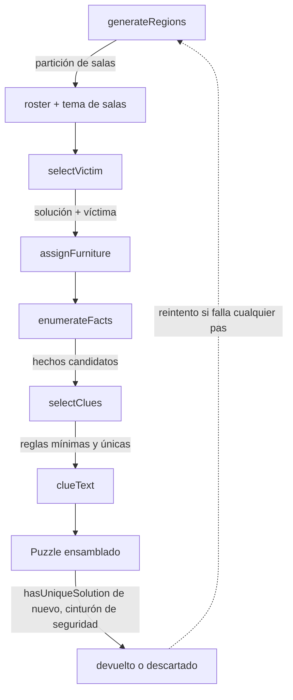

# Generador procedural

Todo bajo `src/lib/` (solver, RNG) y `src/lib/generator/` (el resto), funciones puras
sin imports de Vue/Pinia. Entrada: `generatePuzzle({ difficulty, seed? }): Puzzle`.

## Dificultad → tamaño

| Dificultad | Tamaño |
|---|---|
| muy-fácil | 6×6 |
| fácil / medio / difícil | 9×9 |
| experto | 12×12 |

## Pipeline

Reintento acotado (20 intentos): un fallo en cualquier paso descarta el intento y
prueba otra sub-semilla, derivada de la semilla maestra para no perder reproducibilidad.

## Solver (`solver.ts`)

Backtracking con variable = sospechoso y **MRV** (coloca primero al sospechoso con
menos celdas candidatas). Reglas unarias (`room`, `on-furniture`, `near-furniture`)
anclan el dominio antes de buscar; binarias (`direction`, `adjacent`) se comprueban
por forward-checking. Corta al encontrar 2 soluciones. Tope de nodos (`maxNodes`) como
cinturón de seguridad frente a combinaciones patológicas — no quitarlo (ver "Trampas
conocidas" en [`for-agents.md`](./for-agents.md)).

API: `countSolutions(input, cap?, maxNodes?)`, `hasUniqueSolution(input, maxNodes?)`.

## Regiones (`generator/regions.ts`)

Partición de la cuadrícula N×N en N regiones conexas de N celdas: semillas repartidas,
crecimiento simultáneo (crece primero la región con menos frontera), y una pasada de
intercambios de borde para dar formas en escalera/L en vez de bloques rectos.

## Víctima (`generator/victim.ts`)

Prueba permutaciones de solución aleatorias (sin solver) hasta dar con una donde
alguna sala tenga **exactamente 2** ocupantes — requisito para que el asesino quede
bien definido.

## Mobiliario (`generator/furniture.ts`)

Hasta una instancia de cada tipo (13), anclada en la celda de un sospechoso no-víctima
distinto.

- `rug`/`sofa`/`screen` crecen dentro de la misma sala y **degradan** si no hay hueco
  (una alfombra, un panel de biombo o un sofá recto de 1 celda siguen siendo creíbles).
- `bed`/`piano` (`MUST_GROW_TYPES`) se asignan aparte (`assignMustGrow`) y **nunca**
  caen a 1 celda: si nadie tiene hueco para 2, el tipo se descarta del caso.
- El resto siempre ocupa 1 celda.

## Pistas (`clueFacts.ts` → `selectClues.ts` → `clueText.ts`)

`enumerateFacts` lista todo hecho verdadero de la solución. `selectClues` da a cada
sospechoso su hecho más fuerte (`on-furniture` > `room` > `near-furniture`), confirma
que el conjunto es único y lo minimiza quitando reglas redundantes.

En la práctica solo salen `room` y `on-furniture`: todo sospechoso tiene un `room` que
supera a `near-furniture`, y `direction`/`adjacent` están excluidas (fuerza −1) para
no acercarse al caso patológico del solver. El texto de `on-furniture` siempre sitúa a
la persona *sobre* la celda del mueble (guardarraíl en `clueText.test.ts`), nunca
«junto a»/«pegado a», que son la redacción de `near-furniture`.

## Limitaciones conocidas

- Los casos generados solo usan pistas de sala/mobiliario. Variedad narrativa
  (`direction`/`adjacent`) es trabajo futuro.
- Solo `rug`/`bed`/`piano`/`sofa`/`screen` ocupan más de una celda.
- El solver garantiza unicidad matemática, no que el caso sea resoluble sin tanteo.

Tras cualquier cambio al pipeline, corre `scripts/stress-generate.ts`.
