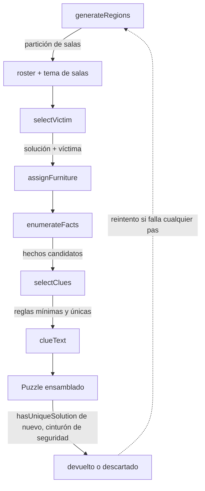

# Generador procedural

Todo vive bajo `src/lib/` (solver, RNG) y `src/lib/generator/` (todo lo demás), como
funciones puras sin ningún import de Vue/Pinia — ver [`architecture.md`](./architecture.md).
Punto de entrada: `generatePuzzle({ difficulty, seed? }): Puzzle`
(`src/lib/generator/generatePuzzle.ts`).

## Mapeo dificultad → tamaño

| Dificultad | Tamaño |
|---|---|
| muy-fácil | 6×6 |
| fácil / medio / difícil | 9×9 |
| experto | 12×12 |

## Pipeline

Todo el pipeline (`tryGenerateOnce` en `generatePuzzle.ts`) está envuelto en un
reintento acotado (20 intentos por defecto): cada paso es individualmente
probabilístico (el crecimiento de salas puede fallar, la selección de víctima puede no
encontrar una sala con exactamente 2 ocupantes, la selección de pistas puede no
alcanzar unicidad) y un fallo en cualquiera simplemente descarta el intento entero y
prueba con una sub-semilla nueva, derivada de la semilla maestra para mantener
reproducibilidad.

## El solver (`src/lib/solver.ts`)

Backtracking con variable = sospechoso (no fila), usando **MRV** (most-remaining-
values): en cada nodo, coloca primero al sospechoso sin colocar con menos celdas
candidatas válidas. Esto hace que las reglas que anclan a una sola celda (p.ej.
`on-furniture`, ya que cada mueble aparece como mucho una vez) se propaguen gratis,
igual que las "naked singles" en un solver de sudoku.

- Reglas **unarias** (`room`, `on-furniture`, `near-furniture`) dependen de una sola
  posición → reducen el dominio de un sospechoso *antes* de empezar la búsqueda.
- Reglas **binarias** (`direction`, `adjacent`) dependen de dos posiciones → se
  comprueban de forma incremental, solo contra sospechosos ya colocados
  (forward-checking).
- Al colocar cada sospechoso, `liveCandidates` recalcula su dominio incorporando
  también las reglas binarias ya evaluables — esto es lo que hace que MRV prefiera de
  verdad procesar a un sospechoso justo después de que se coloque su "pareja" en una
  regla binaria (ver el bug de rendimiento más abajo).
- Parada temprana: en cuanto se encuentran 2 soluciones distintas, corta la búsqueda
  (`cap`, por defecto 2) — nunca hace falta saber cuántas hay, solo si es única.
- **Cinturón de seguridad**: `maxNodes` (por defecto 50.000). Si se supera, el
  resultado se marca `truncated: true` y `hasUniqueSolution` devuelve `false` (un
  resultado inconcluso nunca se trata como "único"). Existe porque el solver, aun con
  MRV y poda, **no es robusto frente a cualquier combinación de reglas** — ver más
  abajo.

API pública: `countSolutions(input, cap?, maxNodes?): SolveResult`,
`hasUniqueSolution(input, maxNodes?): boolean`.

`scripts/verify-puzzle.ts` usa el mismo solver para comprobar los 2 casos hechos a
mano — antes era fuerza bruta doble-permutación ((N!)², inviable más allá de 6x6/7x7),
ahora es el mismo backtracking que usa el generador.

## Generador de salas (`generator/regions.ts`)

Partición de la cuadrícula NxN en N regiones conexas de N celdas:

1. **Semillas** repartidas por muestreo tipo "punto más lejano" (con aleatoriedad vía
   un pool muestreado, no determinista puro, para variedad entre semillas).
2. **Crecimiento simultáneo**: en cada paso, la región con la frontera más pequeña
   crece primero (mismo principio MRV, aplicado a territorio) — evita que una región
   se quede encerrada antes de alcanzar tamaño N.
3. Si una región se queda sin frontera antes de tiempo, el intento se aborta y se
   reintenta desde semillas nuevas (tope `maxAttempts`, por defecto 200).
4. **Fallback garantizado**: si se agotan los intentos, filas rectas de tamaño N
   (siempre válido, nunca cuelga).
5. **Pasada de variedad de forma** ("jaggle"): intercambios locales entre celdas de
   borde de dos regiones vecinas, aceptados solo si ambas siguen siendo conexas tras
   el intercambio — así salen formas en escalera/L, no solo bloques rectangulares.

## Selección de víctima (`generator/victim.ts`)

Prueba permutaciones de solución aleatorias (barato, sin llamar al solver) contra la
misma partición de salas hasta encontrar una donde alguna sala tenga **exactamente 2**
ocupantes — ver [`game-rules.md`](./game-rules.md) para por qué ese número es
obligatorio, no solo deseable.

## Mobiliario (`generator/furniture.ts`)

Hasta una instancia única de cada `FurnitureType` (12 tipos — ver más abajo por qué
12), colocada en la celda-solución de un sospechoso no-víctima distinto cada vez.

## Hechos candidatos (`generator/clueFacts.ts`)

Enumera todo hecho verdadero derivable de la solución fija, para cada sospechoso
no-víctima: sala, mobiliario propio, cercanía a cada mueble presente (positiva o
negada), y dirección/adyacencia respecto a cada otro sospechoso.

**Regla explícita**: nunca se genera un hecho `adjacent` que involucre a la víctima —
como el asesino es por definición quien comparte su sala, esa pista regalaría la
respuesta directamente.

## Selección de pistas (`generator/selectClues.ts`)

Cada sospechoso puede mostrar **como mucho una pista** (`Suspect.clue` es un único
string, no una lista) — esta restricción de contenido es la que dio más problemas, ver
"Bugs reales" abajo. Algoritmo final:

1. A cada sospechoso se le da su **hecho unario más fuerte** disponible
   (`on-furniture` > `room` > `near-furniture` positivo > negado). Nunca se
   seleccionan hechos binarios (`direction`/`adjacent`) — ver más abajo por qué.
2. Se comprueba que el conjunto maximal (uno por sospechoso) es único
   (`hasUniqueSolution`). Si no lo es, se descarta el intento entero.
3. **Minimización**: se intenta quitar cada regla, una a una y en orden aleatorio,
   manteniéndola fuera si el conjunto sigue siendo único. Se repite hasta que una
   pasada completa no quite nada — mínimo local, no global (suficiente, es lo que
   hacen también los generadores de sudoku).

## Bugs reales encontrados (y por qué el diseño es como es)

Estas dos cosas no fueron elegidas por elegancia teórica — se midieron y se
encontraron rotas, y el diseño actual es la corrección:

### 1. El solver explota combinatoriamente sin ningún anclaje unario

Un primer diseño (MRV + forward-checking) se probó contra un caso 12×12 con una cadena
larga de reglas `direction` y **cero** reglas unarias. El número de nodos explorados
seguía exactamente C(2N,N) (20, 70, 252... hasta 2,7 millones en N=12) — exponencial
real, no un bug de bucle infinito (se confirmó instrumentando con un contador de
nodos). Con un caso *realista* (8 sospechosos anclados por mobiliario + una cadena
corta de 4), el mismo N=12 resuelve en 2-3ms.

**Decisión**: no se reescribió el solver con propagación de restricciones completa
(mucho más código para un caso que el generador no produce). En su lugar:
- El solver lleva el cinturón de seguridad `maxNodes` descrito arriba.
- El generador está sesgado a preferir siempre anclajes unarios fuertes antes que
  cadenas de reglas relacionales — ver el punto 3 de la selección de pistas arriba.

### 2. La selección de pistas mezclaba pistas fuertes y débiles

Un primer diseño barajaba **todos** los hechos candidatos juntos (unarios y binarios,
fuertes y débiles) y añadía el primero disponible por sospechoso. Resultado: un
sospechoso podía "gastar" su única pista permitida en una débil (p.ej. `room`) antes
de llegar a la fuerte (`on-furniture`) que tenía disponible, dejando el conjunto final
sistemáticamente insuficiente — **incluso en 6x6**, con fallo del 100% en las
pruebas. La corrección fue dar a cada sospechoso su hecho *más fuerte* directamente
(paso 1 de la sección anterior), no un hecho cualquiera.

### 3. 8 tipos de mobiliario no bastan para "experto" (12x12)

Con 11 sospechosos sin víctima y solo 8 tipos de mobiliario, los 3 sospechosos sin
mobiliario dependían de su pista de `room` — que resultó **sistemáticamente
insuficiente** (40/40 intentos fallidos en pruebas), no un caso raro: una sala tiene N
celdas repartidas por todo el tablero, y solo 1-2 suelen caer dentro de las
filas/columnas libres que quedan tras anclar a los demás — a veces eso no alcanza a
distinguir entre los pocos sospechosos restantes.

**Corrección**: se añadieron 4 tipos de mobiliario más (`table`, `mirror`, `clock`,
`vase` — con sprites nuevos en `scripts/gen-sprites.mjs`), llegando a 12 tipos, más
que suficiente para anclar a los 11 sospechosos que hacen falta como mucho.

### Limitación conocida (no un bug, una decisión de alcance v1)

Como consecuencia del punto 1 y de la corrección del punto 2, **los casos generados
nunca usan pistas de `direction` o `adjacent`** — solo `room`/`on-furniture`/
`near-furniture`. Los 2 casos hechos a mano sí las usan y tienen más variedad
narrativa por ello. Añadir esa variedad de vuelta al generador de forma segura
(sin reintroducir el problema del punto 1) es trabajo futuro, no bloqueante para v1.

## Verificación empírica

`scripts/stress-generate.ts` genera 30 semillas × 5 dificultades (150 casos) y reporta
tasa de éxito y tiempos. Último resultado conocido: 150/150, máximo 34ms (experto).
Ejecutar con `npx tsx scripts/stress-generate.ts` tras cualquier cambio al pipeline.

## Alcance explícitamente fuera de v1

- **Mobiliario multi-celda** (alfombras/sofás en L, ocupando varias casillas): el
  modelo de datos actual (`Cell.furniture` es de una sola casilla) no lo soporta.
  Requeriría un tipo `FurniturePiece { type, cells: Position[] }` y sprites por
  forma o autotile. Ver la nota en `docs/decisions.md`.
- **Verificación de "resoluble por lógica pura"**: el solver garantiza unicidad
  matemática, no que un humano pueda resolverlo sin tanteo en algún punto. Simular
  técnicas de deducción (como hacen los generadores de sudoku serios) es trabajo
  futuro si los casos generados resultan frustrantes de jugar.
