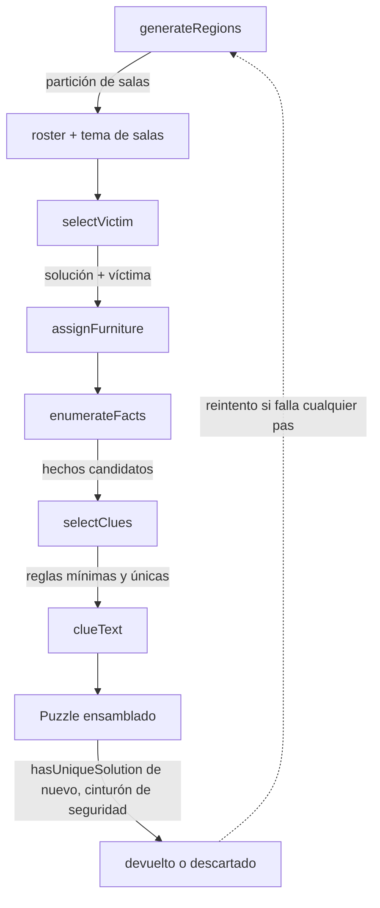

# Generador procedural

Todo vive bajo `src/lib/` (solver, RNG) y `src/lib/generator/` (todo lo demás), como
funciones puras sin ningún import de Vue/Pinia — ver [`architecture.md`](./architecture.md).
Punto de entrada: `generatePuzzle({ difficulty, seed? }): Puzzle`
(`src/lib/generator/generatePuzzle.ts`).

## Mapeo dificultad → tamaño

| Dificultad | Tamaño |
|---|---|
| muy-fácil | 6×6 |
| fácil / medio / difícil | 9×9 |
| experto | 12×12 |

## Pipeline

Todo el pipeline está envuelto en un reintento acotado (20 intentos por defecto): un
fallo en cualquier paso descarta el intento entero y prueba con una sub-semilla nueva,
derivada de la semilla maestra para mantener reproducibilidad.

## El solver (`src/lib/solver.ts`)

Backtracking con variable = sospechoso, usando **MRV** (most-remaining-values): en
cada nodo, coloca primero al sospechoso sin colocar con menos celdas candidatas
válidas. Las reglas unarias (`room`, `on-furniture`, `near-furniture`) anclan a una
posición antes de empezar la búsqueda; las binarias (`direction`, `adjacent`) se
comprueban de forma incremental (forward-checking). Corta la búsqueda en cuanto
encuentra 2 soluciones distintas — nunca hace falta saber cuántas hay, solo si es
única. Incluye un tope de nodos explorados como cinturón de seguridad frente a
combinaciones de reglas patológicas.

API pública: `countSolutions(input, cap?, maxNodes?): SolveResult`,
`hasUniqueSolution(input, maxNodes?): boolean`.

## Generador de salas (`generator/regions.ts`)

Partición de la cuadrícula NxN en N regiones conexas de N celdas: semillas
repartidas por muestreo, crecimiento simultáneo (la región con menos frontera crece
primero), y una pasada de variedad de forma (intercambios locales entre celdas de
borde) para que salgan formas en escalera/L, no solo bloques rectangulares.

## Selección de víctima (`generator/victim.ts`)

Prueba permutaciones de solución aleatorias hasta encontrar una donde alguna sala
tenga **exactamente 2** ocupantes — necesario para que el asesino quede bien definido
(ver [`game-rules.md`](./game-rules.md)).

## Mobiliario y pistas

Hasta una instancia única de cada tipo de mobiliario (13 tipos), anclada en la celda
de un sospechoso no-víctima distinto cada vez. `rug`, `bed`, `piano`, `sofa` y `screen`
pueden extenderse más allá de su ancla dentro de la misma sala (`rug`/`bed`/`piano` en
línea recta hasta 2 celdas, `screen` en línea recta hasta 3, `sofa` en forma de
L/esquina hasta 3) — el resto de tipos siguen ocupando exactamente 1 celda.
`rug`/`sofa`/`screen` degradan con elegancia si no encuentran hueco (`sofa` cae a recta
y luego a 1 celda; `rug`/`screen` caen directo a footprints más pequeños) porque una
alfombra, un sofá o un solo panel de biombo siguen siendo un mueble creíble. `bed`/
`piano` no: una cama o un piano de 1 celda no se leen como tales (ver
`docs/visual-design.md`), así que en vez de degradar se asignan aparte, antes que el
resto (`assignMustGrow` en `generator/furniture.ts`, una vez por cada tipo en
`MUST_GROW_TYPES`), probando cada sospechoso candidato hasta encontrar uno con hueco
para 2 celdas; si ninguno lo tiene, ese tipo se descarta del todo para ese caso en vez
de aparecer en 1 celda. Cada sospechoso muestra como mucho una
pista (`Suspect.clue` es un único string): se le da su hecho unario más fuerte
disponible (`on-furniture` > `room` > `near-furniture`), y luego se minimiza el
conjunto quitando reglas mientras la solución siga siendo única.

## Limitaciones conocidas

- Los casos generados solo usan pistas de sala/mobiliario — nunca `direction` o
  `adjacent` (los casos hechos a mano sí las usan, con más variedad narrativa).
- Solo `rug`/`bed`/`piano`/`sofa`/`screen` ocupan más de una celda; el resto sigue
  anclado a 1 celda. Ampliar esto a más tipos, o a formas más variadas, es trabajo
  futuro.
- El solver garantiza unicidad matemática de la solución, no que sea resoluble sin
  tanteo en algún punto.

`scripts/stress-generate.ts` genera un lote de semillas × dificultades y reporta tasa
de éxito y tiempos — ejecutar tras cualquier cambio al pipeline.
